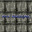

    

        

            

                

                    <a class="txt napravo" href="#">Gmail</a>
                    <a class="txt" href="#">Images</a>
                    

                    
                    

                

            

        

    

        

 

    <form>
        

            

                

                    

                        
                        <svg focusable="false" xmlns="http://www.w3.org/2000/svg" viewBox="0 0 24 24"><path d="M15.5 14h-.79l-.28-.27A6.471 6.471 0 0 0 16 9.5 6.5 6.5 0 1 0 9.5 16c1.61 0 3.09-.59 4.23-1.57l.27.28v.79l5 4.99L20.49 19l-4.99-5zm-6 0C7.01 14 5 11.99 5 9.5S7.01 5 9.5 5 14 7.01 14 9.5 11.99 14 9.5 14z"></path></svg>
                        
                    

                

                    

                    <input class="d1" maxlength:"2048" name:"p" type:"text" title:"Search">
                    </input>
                

            

        

    </form>

