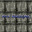

    

        

            

                

                    <a class="txt napravo" href="#">Gmail</a>
                    <a class="txt" href="#">Images</a>
                    

                    
                    

                

            

        

    

    

        
        

            

                <form class="m bord some">
                    <input class ="some" type="text">
                        

                            <button class="button" type="search" target="_top">Google Search</button>
                            <button class="button" type="page" target="_top">I'm feeling lucky</button>
                        

            

                </form>
        

    

